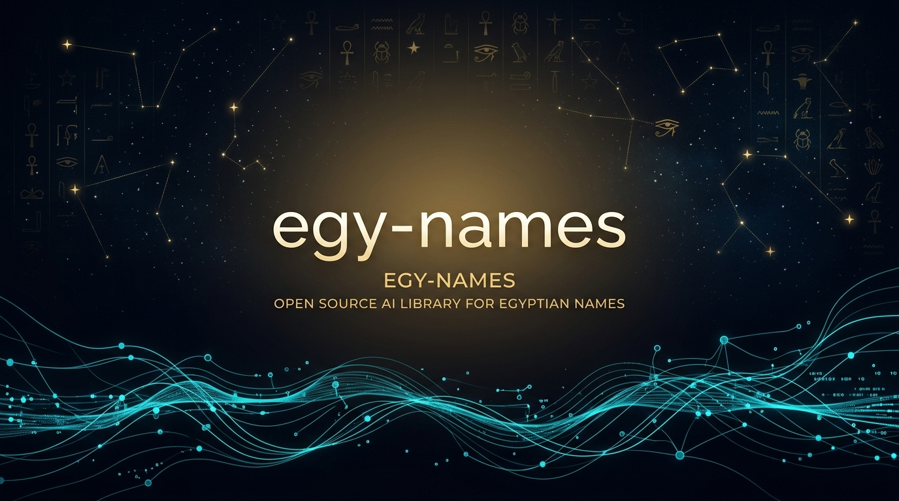
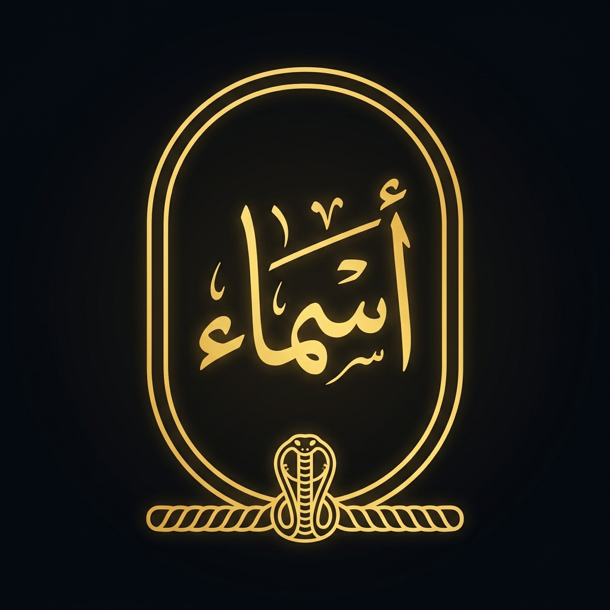

<div align="center">





# 🇪🇬 Egyptian Names (`egy-names`)
### *The Production-Grade Onomastic Intelligence & Computational Linguistic Engine for Egyptian Names*

[-v0.2.1-3776AB?logo=pypi&logoColor=white)](https://pypi.org/project/egy-names/)
[-v0.2.1-CB3837?logo=npm&logoColor=white)](https://www.npmjs.com/package/egy-names)
[-v0.2.1-004880?logo=nuget&logoColor=white)](https://www.nuget.org/packages/egy-names/)
[-v0.2.1-0175C2?logo=dart&logoColor=white)](https://pub.dev/packages/egy_names)
[](https://github.com/AbdullahAfifyKhalil/egy-names)
[](https://central.sonatype.com/artifact/io.github.abdullahafifykhalil/egy-names)
[](https://huggingface.co/datasets/Abdullah-afify/egyptian-names)
[](https://huggingface.co/datasets/Abdullah-afify/egyptian-high-school-students-grades)
[](https://github.com/AbdullahAfifyKhalil/egy-names)
[](https://opensource.org/licenses/MIT)

**Engineered with 100% Deterministic Parity across 7 Major Languages:**
<br />
**Python** • **TypeScript / JavaScript** • **.NET / C#** • **Flutter / Dart** • **Swift (iOS/macOS)** • **Java / Kotlin** • **C++ (C++20/17)**

[Why Egyptian Names?](#-why-egyptian-names-are-unique--computationally-complex) • [Corpus Genesis](#-national-corpus-genesis--scale) • [Key Capabilities](#-key-capabilities) • [Age Intelligence Engine](#-age-aware-demographic-intelligence) • [Installation & Multi-Language Usage](#-installation--multi-language-usage) • [Hugging Face Hub](#-hugging-face-datasets) • [Architecture](#-onomastic-architecture) • [About Afify Corp](#-about-afify-corporation) • [License](#-license)

</div>

---

## 🏛️ Why Egyptian Names Are Unique & Computationally Complex

Unlike Western naming conventions (*Given Name + Surname*), Egyptian naming is governed by an **unbroken patronymic genealogical chain** where a person's legal name is an ordered succession of ancestral personal names:

$$\text{Full Legal Name} = \text{Personal Name} \to \text{Father} \to \text{Grandfather} \to \text{Great-Grandfather} \to \text{Family Surname / Tribe}$$

This ancient onomastic system—intertwined with **Pharaonic & Coptic substrates**, **Classical Arabic morphology**, **Ottoman Turkish guild surnames**, and **Nile Delta/Upper Egypt geographic toponyms**—presents extraordinary computational challenges:

```
┌─────────────────────────────────────────────────────────────────────────────────────────────────────────┐
│                                    THE EGYPTIAN ONOMASTIC SPECTRUM                                     │
├──────────────────────┬──────────────────────┬──────────────────────┬────────────────────────────────────┤
│   Ancient / Coptic   │   Islamic / Arabic   │  Ottoman / Turkish   │     Geographic Toponyms (Nile)     │
├──────────────────────┼──────────────────────┼──────────────────────┼────────────────────────────────────┤
│  مهرائيل (Mehraeil)  │  محمد (Mohamed)      │  بوادقجي (Bawadqgy)  │  المنياوي (Elminyawy - Minya)      │
│  سوريال (Soryal)     │  عبدالرحمن (Abdel..) │  الجوهرجي (Gowharji) │  الطهطاوي (Tahtawy - Tahta)        │
│  بهنس (Bahnas)       │  فاطمة (Fatma)       │  شلتوت (Shaltout)    │  الشناوي (Elshenawy - Shen)        │
│  مينا (Mina)         │  نورالدين (Nour..)   │  خاقان (Khaqan)      │  الدمياطي (Domyaty - Damietta)     │
└──────────────────────┴──────────────────────┴──────────────────────┴────────────────────────────────────┘
```

### The 5 Hard Problems Solved by `egy-names`:
1. **Unspaced Concatenation in Legacy Databases**: Egyptian government and bank archives frequently store unspaced concatenated text (`محمدأحمدعليحسنالشناوي`). Standard tokenizers fail completely; `egy-names` solves this via **Dynamic Programming shortest-path lattice segmentation**.
2. **Generational Slot Drift & Demographics**: The exact same name (`فاروق`, `شهد`, `كريم`) has wildly different probabilities depending on whether it appears as a student ($Slot_1$), a father ($Slot_2$), or a grandfather ($Slot_3$).
3. **Compound Name Integrity**: Prefix-bound names (`عبد الرحمن`, `أبو بكر`, `نور الدين`, `فاطمة الزهراء`, `ذو الفقار`) must be recognized either together or separated without altering genealogical slot counts.
4. **Phonetic Egyptian Passport Transliteration**: Standard Arabic transliterators use Levantine or Gulf phonetics (producing *Jamal*, *Hamid*). `egy-names` enforces authentic Egyptian Civil Registry phonetics (*Gamal*, *Hamed*, *El-*, *Abou-*).
5. **100% Arabic Vocalization & Deep Etymology**: Full diacritization (Tashkeel) and morphological root definitions across the entire national lexicon.

---

## 📊 National Corpus Genesis & Scale

`egy-names` is not built on synthetic models or general web scraping. It is **empirically extracted and verified against 15.88+ Million national examination records** spanning primary, preparatory, and secondary education cohorts across all 27 Egyptian Governorates:

```
[ Phase 0: 15,875,535 Raw Full Name Records (30M+ Historical Registrations) ]
                                   │
                Genealogical Patronymic Chain Tokenization
                                   │
                                   ▼
          [ Phase 1: 63,500,000+ Individual Name Slot Occurrences ]
                                   │
                 Frequency Modeling & Generational Profiling
                                   │
                                   ▼
             [ Phase 2: 43,333 Raw Distinct Word Token Lemmas ]
                                   │
             Orthographic Normalization & Typo Mapping (23,457 Rules)
                                   │
                                   ▼
        [ Phase 3: 44,626 Master Canonical Egyptian Onomastic Lexicon ]
 (100% Arabic Tashkeel • 100% Etymology & Roots • Generational Probability Vectors)
```

### 📈 Full Corpus vs. Unique Lexicon Matrix

| Metric | Empirical Count | Description |
| :--- | :--- | :--- |
| **Total Raw Exam Records** | **15,875,535** | Official student & citizen examination rows across 494 national dataset files |
| **Total Full Name Chains** | **~15.88 Million** | Patronymic chains (e.g., `"محمد أحمد علي حسن الشرقاوي"`) |
| **Unique Full Name Combinations** | **1,545,970+** | Distinct 3-to-5-part patronymic combinations |
| **Total Single Token Occurrences** | **~63,500,000** | Individual name occurrences across all 6 patronymic positions |
| **Raw Distinct Word Tokens** | **43,333** | Unique word forms before spelling correction |
| **Orthographic & Typo Rules** | **23,457** | Deterministic mappings (`عبدالرحمن` $\to$ `عبد الرحمن`, `احمد` $\to$ `أحمد`) |
| **Master Canonical Lexicon** | **44,626** | **The complete verified onomastic dictionary of Egypt** |
| **Diacritization (Tashkeel)** | **100.0% (44,626/44,626)** | Full vowel restoration with Shaddah, Dammah, Kasrah, Fathah |
| **Linguistic Etymology Coverage** | **100.0% (44,626/44,626)** | Roots ($ح-م-د$), Coptic etymology, and Nile toponym attributions |

---

## ⚡ Key Capabilities

```
  ┌───────────────────────┐    ┌───────────────────────┐    ┌───────────────────────┐
  │   ⏳ Age Detection    │    │  🧩 Concatenated DP   │    │  🎯 100% Diacritics   │
  │    & Generation       │    │     Segmentation      │    │      (Tashkeel)       │
  └──────────┬────────────┘    └──────────┬────────────┘    └──────────┬────────────┘
             │                            │                            │
             └────────────────────┐       │       ┌────────────────────┘
                                  ▼       ▼       ▼
                            ┌───────────────────────────┐
                            │    egy-names v0.2.1 Core  │
                            │ (44,626 Canonical Lemmas) │
                            └─────────────┬─────────────┘
                                          │
             ┌────────────────────┬───────┴───────┬────────────────────┐
             ▼                    ▼               ▼                    ▼
  ┌───────────────────────┐ ┌───────────┐ ┌───────────────┐ ┌───────────────────┐
  │ 🔍 Roots & Etymology  │ │ 🔤 Arabic │ │ ⚖️ Demographic│ │ 🎲 Probabilistic  │
  │   (Arabic + English)  │ │ Translit  │ │  & Religion   │ │  Name Generation  │
  └───────────────────────┘ └───────────┘ └───────────────┘ └───────────────────┘
```

---

## ⏳ Age-Aware Demographic Intelligence

The library incorporates an empirical **Gaussian Generational Demographic Model** that maps naming popularity across historical birth years.

### Generational Center Anchors:
Given the national corpus anchor year ($Y_{\text{data}} = 2020$) and Egyptian high-school graduation age ($A_{\text{grad}} = 18$):

$$\text{Student Birth Center (Slot 1)} = 2020 - 18 = \mathbf{2002} \quad (\approx 24\text{ years old in }2026)$$

Applying the average generational gap in Egyptian families ($\Delta_{\text{gen}} = 30\text{ years}$):

| Slot | Generational Role | Implied Birth Center | Typical Age in 2026 | Popular Names Example |
| :--- | :--- | :--- | :--- | :--- |
| **Slot 1** | **Person (Youth)** | **~2002** (1998–2006) | ~24 years | `شهد`, `يارا`, `كريم`, `زياد`, `منة`, `أدهم` |
| **Slot 2** | **Father (Parent)** | **~1972** (1966–1980) | ~54 years | `أشرف`, `عادل`, `طارق`, `عصام`, `مجدي`, `مدحت` |
| **Slot 3** | **Grandfather** | **~1942** (1934–1954) | ~84 years | `فاروق`, `سيد`, `شحاتة`, `بسيوني`, `مرسي`, `طه` |
| **Slot 4** | **Great-Grandfather** | **~1912** (1902–1930) | Historical | `مخلوف`, `حجازي`, `دردير`, `شلتوت`, `قنديل` |
| **Slots 5 & 6**| **Family & Clan** | **Timeless** | Any Age | `الشرقاوي`, `السيد`, `إبراهيم`, `الشناوي` |

### Gaussian Demographic Kernel:
$$w_i = \exp\left(-\frac{1}{2} \left(\frac{\text{Target Birth Year} - \text{Center}_i}{\sigma}\right)^2\right), \quad \sigma = 12\text{ years}$$

### Multi-Token Chain Synthesis:
When given a full chain like `"كريم أشرف فاروق"`:
* Token 1 (`كريم`, slot 0): Implies Person $\approx 24\text{ yrs}$
* Token 2 (`أشرف`, slot 1 / father): Implies Father $\approx 54\text{ yrs} \implies \text{Person} = 54 - 30 = \mathbf{24\text{ yrs}}$
* Token 3 (`فاروق`, slot 2 / grandfather): Implies Grandfather $\approx 84\text{ yrs} \implies \text{Person} = 84 - 60 = \mathbf{24\text{ yrs}}$
* **Synthesis:** Cross-generational agreement triggers a corroboration boost, elevating confidence to **`0.641`**!

---

## 💻 Installation & Multi-Language Usage

### 🐍 1. Python (3.9+)

```bash
pip install --upgrade egy-names
```

```python
from egy_names import EgyNames

e = EgyNames()

# 1. ⏳ Age Detection & Demographics
print(e.names_for_age(24, gender="female", top=3))
# -> [NameInfo(ar='شهد', en='Shahd', ...), NameInfo(ar='يارا', en='Yara', ...)]

det = e.detect_age("كريم أشرف فاروق")
print(f"Age: ~{det.estimated_age} ({det.age_range[0]}–{det.age_range[1]} yrs) | Conf: {det.confidence} | {det.generation_label}")
# -> Age: ~25 (13–37 yrs) | Conf: 0.641 | youth generation

# 2. 🧩 Concatenated DP Splitting
print(e.split("محمدأحمدعليحسنالشناوي"))
# -> ['محمد', 'أحمد', 'علي', 'حسن', 'الشناوي']

# 3. 🎯 100% Vocalization (Tashkeel) & Correction
print(e.tashkeel("محمد عبدالرحمن الشرقاوي"))
# -> "مُحَمَّد عَبْدُالرَّحْمَن الشَّرْقَاوِيّ"

print(e.correct("احمد مصطفا"))
# -> "أحمد مصطفى"

# 4. 🔍 Complete Root Etymology
print(e.meaning("المنياوي"))
# -> {'ar': 'نسبة إلى مدينة المنيا في صعيد مصر...', 'en': 'Attributed to Minya in Upper Egypt...'}

# 5. 🔤 Phonetic Egyptian Transliteration
print(e.translate("محمد عبد الحميد الشاذلي"))
# -> "Mohamed Abdelhamid Elshazly"
```

---

### 📦 2. TypeScript / JavaScript (Node.js & Modern Browsers)

```bash
npm install egy-names@0.2.1
```

```typescript
import { EgyptianNames } from 'egy-names';

const en = new EgyptianNames();

// 1. Generation & Translation
console.log(en.translate("محمد أحمد علي")); 
// -> "Mohamed Ahmed Ali"

// 2. Intelligent Dynamic Programming Splitting
console.log(en.split("محمدأحمدعليحسن")); 
// -> ["محمد", "أحمد", "علي", "حسن"]

// 3. Tashkeel & Correction
console.log(en.tashkeel("محمد عبدالرحمن")); 
// -> "مُحَمَّد عَبْدُالرَّحْمَن"

console.log(en.correct("احمد")); 
// -> "أحمد"

// 4. Demographic Inferences
console.log(en.detectGender("فاطمة الزهراء"));
// -> { gender: 'female', confidence: 0.95 }

console.log(en.detectReligion("مينا جرجس بطرس"));
// -> { religion: 'christian', confidence: 0.98 }
```

---

### 🍎 3. Swift (iOS / macOS / watchOS / visionOS)

Add via Xcode (`File > Add Package Dependencies...`) or in `Package.swift`:
```swift
dependencies: [
    .package(url: "https://github.com/AbdullahAfifyKhalil/egy-names.git", from: "0.2.1")
]
```

```swift
import EgyNames

let en = EgyptianNames()

// Splitting unspaced legacy strings
let parts = en.split("محمدأحمدعليحسن")
print(parts) // ["محمد", "أحمد", "علي", "حسن"]

// Full Tashkeel restoration
print(en.tashkeel("محمد عبدالرحمن")) // مُحَمَّد عَبْدُالرَّحْمَن

// Egyptian passport transliteration
print(en.translate("محمد أحمد علي")) // Mohamed Ahmed Ali
```

---

### 🔷 4. .NET / C#

```bash
dotnet add package egy-names --version 0.2.1
```

```csharp
using EgyNames;

var en = new EgyptianNames();

Console.WriteLine(en.Translate("محمد أحمد علي")); 
// -> Mohamed Ahmed Ali

Console.WriteLine(en.Tashkeel("محمد عبدالرحمن")); 
// -> مُحَمَّد عَبْدُالرَّحْمَن

Console.WriteLine(string.Join(", ", en.Split("محمدأحمدعليحسن"))); 
// -> محمد, أحمد, علي, حسن
```

---

### 🎯 5. Dart / Flutter

```bash
flutter pub add egy_names:^0.2.1
```

```dart
import 'package:egy_names/egy_names.dart';

void main() {
  final en = EgyptianNames();
  
  print(en.translate("محمد أحمد علي")); // Mohamed Ahmed Ali
  print(en.tashkeel("محمد عبدالرحمن")); // مُحَمَّد عَبْدُالرَّحْمَن
  print(en.split("محمدأحمدعليحسن"));    // [محمد, أحمد, علي, حسن]
}
```

---

### ☕ 6. Java / Kotlin

```xml
<dependency>
    <groupId>io.github.abdullahafifykhalil</groupId>
    <artifactId>egy-names</artifactId>
    <version>0.2.1</version>
</dependency>
```

```java
import com.afify.egynames.EgyptianNames;

public class Main {
    public static void main(String[] args) {
        EgyptianNames en = new EgyptianNames();
        System.out.println(en.translate("محمد أحمد علي")); // Mohamed Ahmed Ali
        System.out.println(en.tashkeel("محمد عبدالرحمن")); // مُحَمَّد عَبْدُالرَّحْمَن
    }
}
```

---

### ⚡ 7. Modern C++ (C++20 / C++17)

```cmake
include(FetchContent)
FetchContent_Declare(
    egy_names
    GIT_REPOSITORY https://github.com/AbdullahAfifyKhalil/egy-names.git
    GIT_TAG v0.2.1
)
FetchContent_MakeAvailable(egy_names)
target_link_libraries(your_target PRIVATE egy_names)
```

```cpp
#include <egy_names/egy_names.hpp>
#include <iostream>

int main() {
    egy_names::EgyNames en;
    std::cout << en.translate("محمد أحمد علي") << "\n"; // Mohamed Ahmed Ali
    std::cout << en.tashkeel("محمد عبدالرحمن") << "\n"; // مُحَمَّد عَبْدُالرَّحْمَن
    return 0;
}
```

---

## 🤗 Hugging Face Datasets

The underlying national datasets are open-source and hosted on Hugging Face:

### 1. Egyptian Names Dataset (44.6K Lexicon & 15.88M Corpus)
👉 [**https://huggingface.co/datasets/Abdullah-afify/egyptian-names**](https://huggingface.co/datasets/Abdullah-afify/egyptian-names)
* **`final_canonical` (Default):** 44,626 unique master names with 100% Tashkeel, Arabic/English meanings, and 6-slot generational probabilities.
* **`phase0_raw`:** 1.54M raw full name strings.
* **`phase1_segmented`:** 1.0M segmented patronymic chains.
* **`phase3_corrections`:** 23,457 orthographic correction rules.

```python
from datasets import load_dataset

dataset = load_dataset("Abdullah-afify/egyptian-names")
print(dataset["train"][0])
```

### 2. Egyptian High School Students Degrees Dataset (2017–2026)
👉 [**https://huggingface.co/datasets/Abdullah-afify/egyptian-high-school-students-grades**](https://huggingface.co/datasets/Abdullah-afify/egyptian-high-school-students-grades)
* **3,790,225 Total Records** across 5 national examination cohorts (**2017**, **2023**, **2024**, **2025**, **2026**).

---

## 🏛️ Onomastic Architecture

### 1. Patronymic Lineage Decomposition
The position of a name within an Egyptian patronymic chain defines its legal and social role:

```
[ محمد ]     [ أحمد ]      [ علي ]       [ حسن ]        [ الشاذلي ]
   │            │             │             │               │
Slot 1        Slot 2        Slot 3        Slot 4          Slot 5
Person        Father     Grandfather     Ancestor      Family/Tribe
(اسم الشخص)   (اسم الأب)   (اسم الجد)      (السلف)     (اللقب والعائلة)
```

`egy-names` models the empirical probability $P(\text{Name} \mid \text{Slot}_k)$ across all positions.

### 2. Concatenated Dynamic Programming Segmentation
When processing unspaced Arabic text (`محمدأحمدعليحسنالشاذلي`), the library executes a shortest-path dynamic programming algorithm over Unicode codepoints:

$$\text{Cost}(i) = \min_{j < i} \Big( \text{Cost}(j) + \text{BaseCost} + \text{Bonus}(\text{Freq}_{j..i}) + \lambda \cdot \text{Length}_{j..i} \Big)$$

---

## 🏢 About Afify Corporation

**[Afify Corporation](https://afify.co)** is a technology and intelligence enterprise innovating across software architecture, language engineering, and high-performance machine systems.

- 🌐 **Website**: [**afify.co**](https://afify.co)
- 🐙 **GitHub**: [**@AbdullahAfifyKhalil**](https://github.com/AbdullahAfifyKhalil)
- 👤 **Founder & Lead Architect**: [**Abdullah Afify**](https://github.com/AbdullahAfifyKhalil)

---

## 📄 License & Citation

Distributed under the **MIT License**. See `LICENSE` for details.

```bibtex
@software{afify2026egynames,
  author       = {Abdullah Afify},
  title        = {egy-names: A Production-Grade Onomastic Intelligence & Linguistic Engine for Egyptian Names},
  year         = {2026},
  publisher    = {GitHub},
  version      = {0.2.1},
  url          = {https://github.com/AbdullahAfifyKhalil/egy-names}
}
```

---

<div align="center">
  <sub>Developed with ❤️ by <b><a href="https://github.com/AbdullahAfifyKhalil">Abdullah Afify</a></b> • Backed by <b><a href="https://afify.co">Afify Corporation (afify.co)</a></b></sub>
</div>
